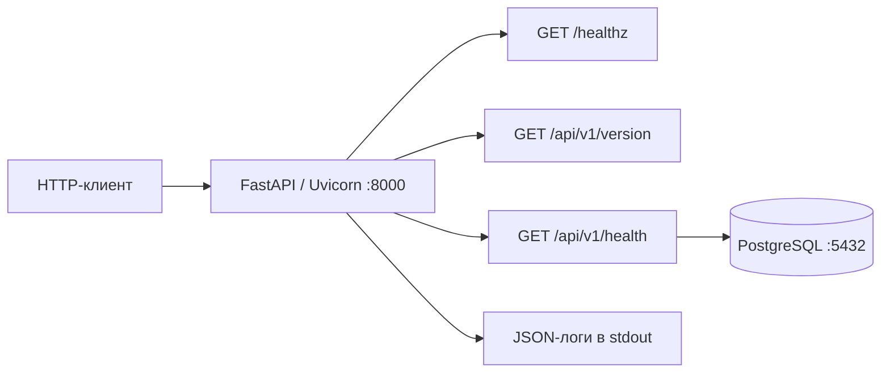

# MLOps2026

Небольшой асинхронный сервис на **FastAPI + PostgreSQL**: проверка доступности приложения
и базы данных, версия сборки, структурированные логи и полный цикл сборки Docker-образа
через GitHub Actions.

Это инфраструктурная основа MLOps-проекта. Текущая реализация содержит служебное API;
обучение моделей, инференс, хранение датасетов и ML-пайплайны пока не реализованы.

**Стек:** Python · FastAPI · Uvicorn · SQLAlchemy asyncio · asyncpg · PostgreSQL 16 · uv · Docker Compose

## Содержание

- [Быстрый старт](#быстрый-старт)
- [Запуск готового релиза](#запуск-готового-релиза)
- [Как устроен сервис](#как-устроен-сервис)
- [Локальная разработка](#локальная-разработка)
- [Конфигурация](#конфигурация)
- [HTTP API](#http-api)
- [Логи](#логи)
- [Тесты и качество кода](#тесты-и-качество-кода)
- [Docker и эксплуатация](#docker-и-эксплуатация)
- [CI/CD и релизы](#cicd-и-релизы)
- [Структура проекта](#структура-проекта)
- [Решение проблем](#решение-проблем)

## Быстрый старт

Нужны Docker с запущенным Docker Engine и Docker Compose v2 с поддержкой `--wait`.
Команды выполняются из корня репозитория в оболочке Bash/Zsh. Для запуска через Docker
устанавливать Python и uv на хост не требуется.

Ниже описана сборка из локальных исходников. Чтобы скачать уже собранный образ,
перейдите к [запуску готового релиза](#запуск-готового-релиза).

### 1. Подготовить окружение

Если `.env` уже существует, используйте его, не перезаписывая свои настройки.
Иначе создайте файл из шаблона:

```bash
cp .env.example .env
```

Заполните `POSTGRES_PASSWORD`: в шаблоне он намеренно оставлен пустым.
Например, для локального окружения:

```dotenv
POSTGRES_DB=mlops
POSTGRES_USER=mlops
POSTGRES_PASSWORD=local-dev-change-me

APP_PORT=8000
LOG_LEVEL=INFO
```

Замените пример пароля собственным. `.env` исключён из Git и контекста Docker-сборки.

### 2. Собрать и запустить

```bash
docker compose up -d --build --wait
docker compose ps
```

Compose сначала дожидается готовности PostgreSQL, затем запускает приложение.
При первой сборке загружаются базовые образы и зависимости.

### 3. Проверить API

```bash
curl --fail-with-body http://localhost:8000/healthz
curl --fail-with-body http://localhost:8000/api/v1/version
curl --fail-with-body http://localhost:8000/api/v1/health
```

Ожидается HTTP `200` для всех трёх запросов. `/healthz` возвращает `{"status":"ok"}`,
а `/api/v1/health` — `"health": true` при доступной базе.

| Интерфейс | Адрес при стандартном порте |
| --- | --- |
| Swagger UI | <http://localhost:8000/docs> |
| ReDoc | <http://localhost:8000/redoc> |
| OpenAPI JSON | <http://localhost:8000/openapi.json> |

Если изменили `APP_PORT`, используйте его вместо `8000` в адресах и запросах.
Корневой маршрут `/` не определён и возвращает `404`.

## Запуск готового релиза

Релизная сборка публикуется как Docker-образ в **GitHub Container Registry**:
`ghcr.io/ivampo/mlops2026`. Для тега Git `v0.2.0` образ имеет тег `0.2.0` — без `v`.
Это готовое приложение со всеми Python-зависимостями; PostgreSQL запускается отдельным
контейнером. Клонировать репозиторий, устанавливать Python и собирать приложение не нужно.

Для команд ниже нужны Docker Engine, **Docker Compose 2.24.4+** и `curl`.
Пример использует опубликованный релиз `0.2.0`; доступные сборки можно проверить
в [истории CD](https://github.com/ivampo/MLOps2026/actions/workflows/cd.yml).

### 1. Скачать конфигурацию выбранного релиза

В отдельном каталоге скачайте Compose-файл и шаблон окружения из того же тега:

```bash
mkdir -p mlops-release
cd mlops-release

curl --fail --location --output docker-compose.yml \
  https://raw.githubusercontent.com/ivampo/MLOps2026/v0.2.0/docker-compose.yml
curl --fail --location --output .env.example \
  https://raw.githubusercontent.com/ivampo/MLOps2026/v0.2.0/.env.example
```

Создайте `.env`, сохранив существующий файл, если он уже есть:

```bash
test -f .env || cp .env.example .env
```

Откройте `.env` и задайте непустой `POSTGRES_PASSWORD`, как в [быстром старте](#быстрый-старт).
Если порт `8000` уже занят другим экземпляром приложения, задайте, например, `APP_PORT=8080`.

### 2. Подключить готовый образ

Рядом создайте файл `compose.release.yaml`:

```yaml
services:
  app:
    image: ghcr.io/ivampo/mlops2026:0.2.0
    platform: linux/amd64
    build: !reset null
```

Дополнение сохраняет базу, том, сеть и healthcheck из основного Compose-файла,
задаёт релизный образ и удаляет настройку локальной сборки через
[`!reset`](https://docs.docker.com/reference/compose-file/merge/#reset-value).
Образ `0.2.0` опубликован для `linux/amd64`; на Apple Silicon и других ARM-хостах
для него нужна поддержка эмуляции amd64 в Docker. PostgreSQL использует образ для
архитектуры своего хоста.

### 3. Скачать образы и запустить сервисы

```bash
docker compose -f docker-compose.yml -f compose.release.yaml config --quiet
docker compose -f docker-compose.yml -f compose.release.yaml pull
docker compose -f docker-compose.yml -f compose.release.yaml up -d --no-build --wait
```

`pull` скачивает приложение и PostgreSQL, а `up` запускает их и дожидается healthcheck.
Затем проверьте версию и соединение с базой:

```bash
curl --fail-with-body http://localhost:8000/api/v1/version
curl --fail-with-body http://localhost:8000/api/v1/health
```

Для этого примера ожидаются `{"version":"0.2.0"}` и ответ с `"health": true`.
Swagger UI доступен на <http://localhost:8000/docs>.
Если меняли `APP_PORT`, замените `8000` в адресах своим портом.

### Управление и обновление

Для этого способа запуска во всех командах указывайте оба Compose-файла:

```bash
# Состояние и логи приложения
docker compose -f docker-compose.yml -f compose.release.yaml ps
docker compose -f docker-compose.yml -f compose.release.yaml logs --tail=100 app

# Остановить и удалить контейнеры, сохранив данные PostgreSQL
docker compose -f docker-compose.yml -f compose.release.yaml down
```

Для обновления выберите успешно опубликованный релиз, скачайте конфигурацию из его
Git-тега и измените тег `image` в `compose.release.yaml`. Сохраните свой `.env`, затем
повторите `pull` и `up -d --no-build --wait` с обоими файлами. Данные базы остаются
в именованном томе при использовании того же каталога и имени Compose-проекта.

Если `pull` сообщает `manifest unknown`, проверьте успешность CD и точное имя образа:
путь записывается строчными буквами, а тег версии — без начального `v`.
Архив **Source code** на GitHub содержит исходники; готовый контейнер скачивается
командой `docker compose … pull`, приведённой выше.

## Как устроен сервис



При старте приложение создаёт асинхронный SQLAlchemy engine, а при остановке освобождает
его через `dispose()`. Само создание engine не проверяет доступность базы: соединение
потребуется при запросе `/api/v1/health`. В пуле включён `pool_pre_ping`.

Проверка базы выполняет `SHOW server_version`, измеряет время операции и ограничивается
таймаутом. Таблицы, миграции и операции с прикладными данными в проекте пока отсутствуют.

Две проверки имеют разное назначение:

- **Liveness — `/healthz`:** HTTP-приложение отвечает. База данных не проверяется.
- **Проверка зависимостей — `/api/v1/health`:** приложение может обратиться к PostgreSQL;
  при ошибке возвращает HTTP `503`. Этот маршрут можно использовать как readiness-проверку.

Docker healthcheck приложения обращается к `/healthz`. Поэтому статус контейнера
`healthy` сам по себе не гарантирует доступность базы; её нужно проверять через `/api/v1/health`.

## Локальная разработка

Нужны Python **3.12.2+**, uv и доступный PostgreSQL. В [`.python-version`](.python-version)
закреплён Python `3.12.2`; в CI используется uv `0.12.15`, в Docker-сборке — `0.12.18`.

### Установка зависимостей

```bash
uv sync --locked
```

Команда создаёт `.venv`, устанавливает сам пакет и группы `web` и `dev` по `uv.lock`.
`--locked` проверяет согласованность lock-файла с `pyproject.toml` и не обновляет его.
Отдельно активировать виртуальное окружение для команд `uv run` не требуется.

Рабочие зависимости находятся в группе `web`, а не в `project.dependencies`.
Для полного окружения используйте `uv sync`; обычный `pip install .` не установит FastAPI,
Uvicorn и драйвер базы. Установка пакета также нужна для чтения его версии через
`importlib.metadata`.

### PostgreSQL для приложения на хосте

Подготовьте `.env` по [быстрому старту](#быстрый-старт). В основном Compose-файле порт базы
не опубликован на хост. Чтобы локальный Python-процесс мог подключиться, создайте
`compose.dev.yaml` со следующим содержимым:

```yaml
services:
  db:
    ports:
      - "127.0.0.1:5432:5432"
```

Если ранее запускали весь стек, сначала остановите контейнер приложения командой
`docker compose stop app`, чтобы освободить порт `8000`.
Затем запустите только базу с этим дополнением:

```bash
docker compose -f docker-compose.yml -f compose.dev.yaml up -d --wait db
```

При уже установленном PostgreSQL можно использовать его, указав параметры подключения в `.env`.

### Запуск приложения

```bash
uv run mlops
```

Равнозначный запуск через модуль:

```bash
uv run python -m mlops
```

Оба варианта настраивают JSON-логи и читают `HOST`, `PORT`, `LOG_LEVEL` из конфигурации.
По умолчанию сервер слушает `0.0.0.0:8000` и работает без автоматической перезагрузки.

Для разработки с перезагрузкой при изменении кода:

```bash
uv run uvicorn mlops.main:app --reload --host 127.0.0.1 --port 8000
```

При прямом запуске Uvicorn функция `mlops.__main__.main()` не вызывается: настройка
JSON-логов из неё не применяется, а адрес, порт и параметры логирования сервера задаются
аргументами Uvicorn. Настройки PostgreSQL приложение продолжает читать из `.env` и окружения.

## Конфигурация

Источник настроек — [`src/mlops/config.py`](src/mlops/config.py). Приложение читает
переменные окружения и `.env` из текущего рабочего каталога; переменные окружения имеют
приоритет. Неизвестные поля `.env` игнорируются. Конфигурация кешируется на время жизни
процесса, поэтому после изменений приложение нужно перезапустить.

| Переменная | Значение по умолчанию в Python | Назначение |
| --- | --- | --- |
| `POSTGRES_HOST` | `localhost` | Адрес базы; Compose принудительно задаёт приложению `db` |
| `POSTGRES_PORT` | `5432` | Порт подключения к PostgreSQL |
| `POSTGRES_USER` | `postgres` | Пользователь базы; в `.env.example` указан `mlops` |
| `POSTGRES_PASSWORD` | Нет, поле обязательное | Пароль подключения; в `.env.example` пустой |
| `POSTGRES_DB` | `mlops` | Имя базы |
| `HOST` | `0.0.0.0` | Адрес привязки сервера при запуске `mlops` |
| `PORT` | `8000` | Порт Uvicorn при запуске `mlops` |
| `LOG_LEVEL` | `INFO` | Уровень логирования, например `DEBUG`, `INFO`, `WARNING`, `ERROR` |
| `DB_CONN_TIMEOUT` | `10` | Таймаут установки соединения с базой, секунды |
| `HEALTH_TIMEOUT` | `5` | Общий таймаут проверки базы в `/api/v1/health`, секунды |
| `APP_PORT` | `8000` в Compose | Опубликованный порт приложения на хосте; не является полем Python-конфигурации |

**`APP_PORT` и `PORT` — разные настройки.** В Compose используется проброс
`${APP_PORT:-8000}:8000`, а healthcheck обращается к внутреннему порту `8000`.
Чтобы открыть Docker-приложение на `8080`, задайте `APP_PORT=8080`, оставив `PORT=8000`.
Для локального процесса используйте `PORT=8080 uv run mlops`.

Аналогично, `POSTGRES_PORT` меняет адрес подключения приложения, но не перенастраивает
сервер PostgreSQL в контейнере. При стандартном Docker-запуске оставьте его равным `5432`,
а `HOST` — `0.0.0.0`.

Пароль хранится в конфигурации как `SecretStr`, но DSN собирается строковой интерполяцией
без URL-кодирования. В текущей реализации символы вроде `@`, `/`, `:`, `?` и `#` в реквизитах
могут нарушить разбор адреса. Для приведённых инструкций используйте пароль из букв,
цифр, дефисов и подчёркиваний; поддержку произвольных реквизитов нужно доработать в коде.

## HTTP API

Все прикладные ответы ниже имеют формат JSON. Авторизация в текущей реализации отсутствует.

| Метод | Маршрут | Успех | Ошибка зависимости | Назначение |
| --- | --- | --- | --- | --- |
| `GET` | `/healthz` | `200` | Не проверяет зависимости | Доступность HTTP-приложения |
| `GET` | `/api/v1/version` | `200` | — | Версия установленного пакета |
| `GET` | `/api/v1/health` | `200` | `503` | Состояние PostgreSQL |

### `GET /healthz`

```json
{"status": "ok"}
```

Маршрут не версионирован: `/api/v1/healthz` возвращает `404`.
При недоступной базе `/healthz` продолжает возвращать `200`, если приложение запущено.

### `GET /api/v1/version`

```json
{"version": "0.2.0"}
```

Версия берётся из метаданных установленного пакета `mlops`; текущая версия объявлена
в [`pyproject.toml`](pyproject.toml). После изменения версии обновите установленный пакет
или пересоберите Docker-образ.

### `GET /api/v1/health`

Пример успешного ответа, HTTP `200`:

```json
{
  "health": true,
  "components": [
    {
      "name": "postgres",
      "health": true,
      "version": "16.4",
      "response_time": 2.34,
      "error": null
    }
  ]
}
```

Версия PostgreSQL и время в примере условные. `response_time` измеряется в **миллисекундах**,
округляется до двух знаков и включает получение соединения и выполнение запроса.

Пример ошибки зависимости, HTTP `503`:

```json
{
  "health": false,
  "components": [
    {
      "name": "postgres",
      "health": false,
      "version": null,
      "response_time": null,
      "error": "connection failed"
    }
  ]
}
```

`error` содержит текст фактического исключения; при таймауте строка может быть пустой.
Общий `health` равен `true`, только если здоровы все компоненты. Сейчас компонент один —
`postgres`. Текст ошибок возвращается клиенту без дополнительного обезличивания.

Для диагностики вместе с HTTP-статусом:

```bash
curl -i http://localhost:8000/api/v1/health
```

## Логи

При запуске через `mlops` приложение пишет в `stdout` по одному JSON-объекту на строку.
Основные поля: `timestamp`, `level`, `logger`, `message`. При наличии исключения добавляется
`exception` с traceback; дополнительные поля события находятся на верхнем уровне объекта.

Пример записи обработанного HTTP-запроса:

```json
{"timestamp":"2026-09-24 12:00:00,000","level":"INFO","logger":"mlops.access","message":"request","method":"GET","path":"/api/v1/health","status":200,"duration_ms":3.21}
```

- `mlops.access` записывает метод, путь, HTTP-статус и длительность обработки в миллисекундах.
- `app started` содержит версию пакета, уровень логирования, адрес и имя базы.
- `postgres ping failed` сообщает об ошибке проверки базы на уровне `WARNING`.
- `engine disposed` отмечает освобождение engine при штатной остановке.

Временная метка использует стандартный формат Python logging и не содержит часового пояса.
Штатный access log Uvicorn при запуске через `mlops` отключён, чтобы не дублировать записи
middleware. Запись middleware создаётся после получения ответа; необработанные исключения
до этого момента могут не попасть в такой access log.

```bash
docker compose logs -f --tail=100 app
docker compose logs -f --tail=100 db
```

JSON-формат относится к приложению; контейнер PostgreSQL ведёт собственные логи.

## Тесты и качество кода

После `uv sync --locked` доступны следующие проверки:

```bash
uv run pytest
uv run pytest --cov --cov-report=term-missing
uv run ruff check .
uv run ruff format --check .
```

Порог покрытия при запуске с `--cov` — **85%**, включён учёт ветвлений.
`src/mlops/__main__.py` исключён из отчёта. Обычный `uv run pytest` покрытие не проверяет.

Тесты проверяют liveness, версию пакета, успешный ответ проверки базы, отказ соединения,
таймаут, ошибку SQLAlchemy и JSON-логирование. Они используют HTTPX с ASGI transport;
обращение к базе в тестах health подменяется. Живой PostgreSQL для этого набора не нужен,
а тестовая фикстура сама задаёт `POSTGRES_PASSWORD`.

Полный набор локальных хуков, который также запускается в CI:

```bash
uv run pre-commit install
uv run pre-commit run --all-files --show-diff-on-failure
```

Первый запуск pre-commit требует доступа к репозиториям хуков и загрузки их окружений.
Хуки проверяют окончания строк, пробелы, YAML/TOML/JSON, конфликты слияния, симлинки,
крупные файлы и приватные ключи. Ruff проверяет и форматирует Python-код.
Часть хуков **изменяет файлы**, включая `ruff-check --fix`: просмотрите изменения
и повторите проверку перед коммитом.

## Docker и эксплуатация

[`Dockerfile`](Dockerfile) использует двухэтапную сборку на `python:3.12-slim-trixie`:
builder устанавливает зависимости и пакет через uv, затем готовое `.venv` переносится
в финальный образ. Группа `dev` не устанавливается, группа `web` сохраняется.
В финальном контейнере приложение работает от пользователя `app`, команда запуска — `mlops`.

[`docker-compose.yml`](docker-compose.yml) определяет:

| Ресурс | Настройка |
| --- | --- |
| База | `postgres:16-alpine`, именованный том `pgdata` |
| Сеть | `backend`, соединяет приложение и базу |
| Порты | На хост опубликован только порт приложения |
| Healthcheck базы | `pg_isready`, интервал 10 с, таймаут 5 с, 5 попыток |
| Healthcheck приложения | HTTP `/healthz`, интервал 10 с, таймаут 5 с, 5 попыток, начальный период 10 с |
| Перезапуск | `unless-stopped` для обоих сервисов |
| Лимиты в конфигурации | База: 1 CPU / 1 ГБ; приложение: 1 CPU / 512 МБ |
| Ротация логов | `max-size: 10m`, `max-file: 3` для обоих сервисов |

Повседневные команды:

```bash
# Состояние сервисов
docker compose ps

# Пересборка после изменений кода или зависимостей
docker compose up -d --build --wait

# Перечитать изменённый .env в контейнере приложения
docker compose up -d --force-recreate app

# Открыть psql с пользователем и базой из окружения контейнера
docker compose exec db sh -c 'psql -U "$POSTGRES_USER" -d "$POSTGRES_DB"'

# Остановить стек и удалить контейнеры, сохранив данные PostgreSQL
docker compose down
```

При работе с `compose.dev.yaml` используйте те же два аргумента `-f`, что и при запуске.
Обычный `docker compose restart app` не обновляет окружение контейнера из изменённого `.env`;
для этого нужен `up` с пересозданием.

**Полный сброс локальной базы удаляет данные без восстановления:**

```bash
docker compose down -v
```

Переменные `POSTGRES_USER`, `POSTGRES_PASSWORD` и `POSTGRES_DB` инициализируют PostgreSQL
при создании пустого каталога данных. Их изменение в `.env` не меняет уже созданных
пользователей, пароли и базы в существующем томе. Обновите их через PostgreSQL либо
пересоздайте том, если данные больше не нужны.

## CI/CD и релизы

### CI

Workflow [`.github/workflows/ci.yml`](.github/workflows/ci.yml) запускается при push в `main`
и pull request в `main`. Три независимые задачи выполняют:

1. **Lint:** установку зависимостей из lock-файла и все pre-commit hooks.
2. **Tests:** pytest с отчётом покрытия и порогом 85%.
3. **Docker:** сборку и запуск Compose-стека, затем запрос `/api/v1/health` с настоящей базой.

Для повторных запусков одного workflow на одном ref предыдущий запуск отменяется.

### Публикация образа

Workflow [`.github/workflows/cd.yml`](.github/workflows/cd.yml) запускается при push тега
по шаблону `v*.*.*`, например `v0.2.0`. Он:

1. Сравнивает тег без начального `v` с `project.version` из `pyproject.toml`.
2. Авторизуется в GitHub Container Registry через `GITHUB_TOKEN`.
3. Собирает и публикует образ в `ghcr.io/<owner>/<repository>`.
4. Запускает опубликованный образ и проверяет `/api/v1/version`.

В metadata-action настроены теги полной версии, `major.minor`, `major` и длинного SHA.
Проверка после публикации выполняется без PostgreSQL и подтверждает ответ endpoint версии;
она не сравнивает тело ответа с тегом и не проверяет доступность базы.
Workflow публикует образ, но не разворачивает его на сервере. Запуск CD не зависит от
успешного завершения CI, поэтому перед релизом проверьте его результат самостоятельно.

Порядок подготовки релиза:

1. Обновите `project.version` в `pyproject.toml`.
2. Выполните `uv lock`, затем `uv sync --locked`.
3. Запустите проверки, закоммитьте изменения вместе с `uv.lock` и отправьте коммит.
4. После успешного CI создайте и отправьте тег `v<версия>` на этот коммит.
5. Проверьте результат CD и опубликованный пакет в GitHub Container Registry.

Основной Compose-файл использует `build: .` для сборки из исходников.
Для опубликованного образа из GHCR используйте дополнение из раздела
[«Запуск готового релиза»](#запуск-готового-релиза).

## Структура проекта

```text
.
├── .github/workflows/
│   ├── ci.yml                 # Линтеры, тесты, проверка Compose-стека
│   └── cd.yml                 # Публикация образа по тегу версии
├── src/mlops/
│   ├── __main__.py            # CLI mlops, логирование и запуск Uvicorn
│   ├── main.py                # FastAPI, lifespan и middleware запросов
│   ├── config.py              # Настройки из окружения и .env
│   ├── db.py                  # Асинхронный engine и проверка PostgreSQL
│   ├── logging.py             # JSON formatter и настройка stdout
│   ├── schemas.py             # Pydantic-модели ответов
│   └── api/
│       ├── healthz.py          # GET /healthz
│       └── v1/
│           ├── __init__.py     # Общий префикс /api/v1
│           ├── health.py       # GET /api/v1/health
│           └── version.py      # GET /api/v1/version
├── tests/                     # Тесты API и логирования, общие фикстуры
├── .env.example               # Минимальный шаблон окружения
├── .pre-commit-config.yaml    # Проверки перед коммитом
├── .python-version            # Версия Python для uv
├── Dockerfile                 # Двухэтапная сборка
├── docker-compose.yml         # Приложение, PostgreSQL, сеть и том
├── pyproject.toml             # Пакет, зависимости и настройки проверок
└── uv.lock                    # Зафиксированные версии зависимостей
```

## Решение проблем

| Симптом | Что проверить |
| --- | --- |
| Compose сообщает, что `.env` отсутствует | Создайте его из `.env.example` и заполните пароль |
| PostgreSQL не проходит первоначальный запуск | Проверьте непустой `POSTGRES_PASSWORD` и `docker compose logs db` |
| `ValidationError` для `postgres_password` | Переменная обязательна даже для запуска без живой базы; проверьте окружение и рабочий каталог |
| `/healthz` отвечает `200`, а `/api/v1/health` — `503` | Это разные проверки; посмотрите `components[0].error`, логи приложения и базы |
| Локальный Python не подключается к Compose-базе | Опубликуйте `5432` через `compose.dev.yaml`; на хосте используйте `POSTGRES_HOST=localhost` |
| Порт `8000` занят | Для Docker смените `APP_PORT`; для локального запуска — `PORT` или `--port` Uvicorn |
| Порт `5432` занят | Остановите конфликтующую локальную базу или опубликуйте `127.0.0.1:5433:5432` и задайте локальному приложению `POSTGRES_PORT=5433` |
| Контейнер приложения `unhealthy` | Проверьте логи и внутренние `HOST=0.0.0.0`, `PORT=8000`; смена `APP_PORT` внутренний порт не меняет |
| После изменения пароля база не пускает | Пароль в существующем томе не меняется от редактирования `.env`; обновите его в PostgreSQL |
| `PackageNotFoundError: mlops` или отсутствуют зависимости | Выполните `uv sync --locked` и запускайте через `uv run` |
| `uv sync --locked` сообщает о рассогласовании | После намеренного изменения зависимостей выполните `uv lock` и закоммитьте оба файла |
| Релиз остановлен на проверке версии | Тег без `v` должен точно совпадать с `project.version` |
| Изменения `.env` не применяются в Docker | Пересоздайте приложение через `docker compose up -d --force-recreate app` |
