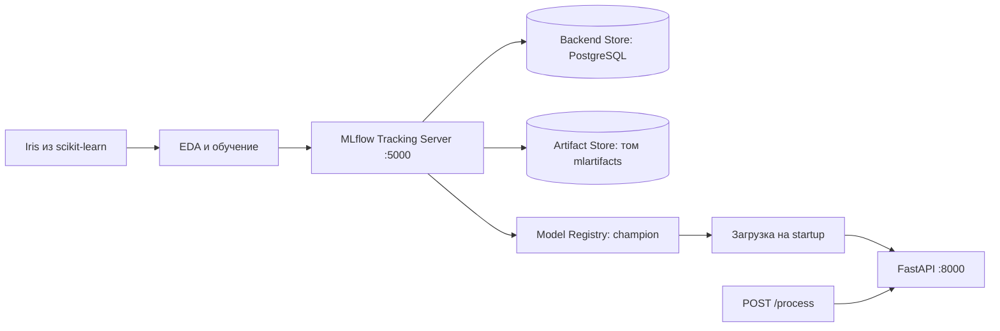

# MLOps2026

Небольшой асинхронный сервис на **FastAPI + PostgreSQL + MLflow**.
ДЗ №2 даёт инфраструктуру: служебное API, JSON-логи, Docker, тесты и CI/CD.
ДЗ №3 добавляет полный путь от датасета и экспериментов до модели в `POST /process`.

**Стек:** Python 3.12 · FastAPI · SQLAlchemy asyncio · PostgreSQL 16 · MLflow · scikit-learn · uv

## Быстрый старт

Нужны Docker Engine и Docker Compose v2 с поддержкой `--wait`. Команды выполняются
из корня проекта. Python на хосте для этого способа запуска не нужен.

### 1. Окружение

Если `.env` ещё нет:

```bash
cp .env.example .env
```

Задайте непустой `POSTGRES_PASSWORD`. Файл `.env` исключён из Git и Docker-сборки.
Остальные настройки можно оставить по умолчанию.

### 2. MLflow и обучение

```bash
docker compose up -d --build --wait db mlflow
docker compose --profile training run --rm train
```

Первая команда запускает PostgreSQL и Tracking Server. Вторая выполняет EDA,
обучает три модели, регистрирует две версии и назначает лучшей alias `champion`.
Датасет Iris входит в scikit-learn; скачивать данные отдельно не требуется.

### 3. Приложение

```bash
docker compose up -d --wait app
```

При первом запуске важен именно этот порядок: приложению нужна зарегистрированная
модель. Если alias отсутствует или модель не загружается, startup завершается ошибкой.
После первого обучения обычный `docker compose up -d --build --wait` поднимает весь стек.
Обучение запускается отдельно и не повторяется при каждом старте приложения.

| Интерфейс | Адрес |
| --- | --- |
| MLflow UI | <http://127.0.0.1:5000> |
| Swagger UI | <http://localhost:8000/docs> |
| Версия загруженной модели | <http://localhost:8000/api/v1/model> |

### 4. Inference

Размеры цветка передаются в сантиметрах:

```bash
curl --fail-with-body http://localhost:8000/process \
  -H 'Content-Type: application/json' \
  -d '{"samples":[{"sepal_length":5.1,"sepal_width":3.5,"petal_length":1.4,"petal_width":0.2}]}'
```

Ответ содержит `model` с именем, точной версией, alias и `run_id`, а также `predictions`
с видом цветка и вероятностями трёх классов. Порядок ответов совпадает с порядком входов.
Можно передать от 1 до 1000 объектов. Признаки обязательны, должны быть конечными
положительными числами; лишние поля запрещены. Некорректный запрос получает HTTP `422`.

## Как устроен проект


```mermaid
flowchart LR
    Data[Iris из scikit-learn] --> Train[EDA и обучение]
    Train --> Tracking[MLflow Tracking Server :5000]
    Tracking --> DB[(Backend Store: PostgreSQL)]
    Tracking --> Artifacts[(Artifact Store: том mlartifacts)]
    Tracking --> Registry[Model Registry: champion]
    Registry --> Startup[Загрузка на startup]
    Startup --> App[FastAPI :8000]
    Client[POST /process] --> App
```

**Backend Store** хранит метаданные: эксперименты, Runs, параметры, метрики, входные
датасеты, версии модели и aliases. **Artifact Store** — отдельный постоянный том
для моделей, графиков, CSV и отчётов. Tracking Server проксирует загрузку и скачивание
артефактов по HTTP через `--serve-artifacts`; клиентам достаточно адреса MLflow.
Том артефактов не монтируется в приложение или контейнер обучения.

Все Python-сервисы используют один образ и одинаковые версии библиотек из `uv.lock`.
В финальном образе нет группы `dev`; процессы работают от пользователя `app`.
PostgreSQL и артефакты сохраняются в отдельных именованных томах.

При старте FastAPI разрешает alias в конкретную версию и загружает
`models:/iris-classifier/<version>` один раз. Это исключает ситуацию, когда alias
переключился между получением метаданных и скачиванием модели. Сохранённый sklearn
Pipeline включает preprocessing, поэтому обучение и inference используют одинаковые
преобразования. Загрузка и вычисления выполняются через `asyncio.to_thread`, освобождая
цикл событий. После startup `/process` не обращается к MLflow.

## Датасет, EDA и эксперименты

Используется [Iris из scikit-learn](https://scikit-learn.org/stable/modules/generated/sklearn.datasets.load_iris.html):
150 измерений, четыре признака и три вида по 50 наблюдений.
Названия признаков приведены к полям API, числовые метки — к именам видов.

В Run `eda` сохраняются:

- `summary.json`: размер, пропуски, дубликаты и количество наблюдений каждого класса;
- `statistics.csv`: описательные статистики;
- графики баланса классов, размеров лепестков и корреляций;
- `notes.md`: краткие выводы и обоснование моделей и метрик;
- `dataset/iris.csv` и `dataset/split.json`: снимок данных с номерами строк и разбиение.

Пропусков нет. Один полный дубликат удаляется до разбиения, чтобы одинаковые наблюдения
не попали в разные части. Получаются **89 train / 30 validation / 30 test**, с сохранением
пропорций классов и `random_state=42`. Все модели используют одно разбиение.
`StandardScaler` обучается только на train внутри Pipeline.

| Run | Модель | Зачем сравниваем |
| --- | --- | --- |
| `baseline` | `DummyClassifier(strategy="prior")` | Ориентир без использования признаков |
| `logistic_regression` | `StandardScaler` + `LogisticRegression(C=1)` | Простая линейная граница |
| `random_forest` | 100 деревьев, `max_depth=3` | Нелинейная модель с ограничением сложности |

Основная метрика — **macro F1**: каждый класс имеет одинаковый вес. Дополнительные —
accuracy и log loss. У каждой модели есть `train_f1_macro`, validation-метрики,
матрица ошибок, classification report и CSV с предсказаниями.

Среди двух обученных моделей выбирается максимальный `val_f1_macro`; при равенстве —
меньший `val_log_loss`. Test оценивается только у победителя после выбора и не участвует
в сравнении. В его Run сохраняются `test_*`, диагностика, `comparison.csv` и `selection.json`.
Pipeline каждой модели сохраняется вместе с signature, input example и версиями зависимостей.
Две обученные модели получают разные версии в Registry; baseline остаётся в Tracking.
Повторный запуск обучения создаёт новые Runs и версии и обновляет `champion`.

### Dataset Tracking: source, digest, lineage

Датасет создаётся через `mlflow.data.from_pandas` и связывается с Run через `mlflow.log_input`:

- **source** — CSV из установленного scikit-learn, из которого получены данные;
  версия scikit-learn записана в параметрах Run;
- **digest** — автоматически рассчитанный MLflow отпечаток конкретного DataFrame;
  у полного датасета, train, validation и test свои отпечатки;
- **lineage** — путь исходных данных через переименование, удаление дубликата и разбиение
  к Run, версии модели и приложению. Контексты входов показывают назначение каждой части,
  а тег `eda_run_id` связывает обучающие Runs с EDA и снимком разбиения.

`log_input` сохраняет метаданные, поэтому сам CSV дополнительно записывается как артефакт.
Локальный source внутри контейнера не является общедоступным URL: для просмотра данных
на другой машине используйте снимок из артефактов EDA.

## Что показать на защите

1. Откройте Experiment `iris-classification` в MLflow UI: Run `eda`, графики и выводы.
2. Выберите три модельных Run и нажмите **Compare**. Покажите параметры,
   `val_f1_macro`, accuracy, log loss, матрицы ошибок и входные датасеты.
3. Откройте Registered Model `iris-classifier`: две версии, связь каждой с Run и `champion`.
4. Отправьте запрос в `/process`, покажите версию и `run_id` в ответе.
5. Перенесите alias `champion` на другую версию в UI. Работающее приложение пока
   сохраняет прежнюю модель. Затем выполните:

```bash
docker compose restart app
curl --fail-with-body http://localhost:8000/api/v1/model
```

Версия меняется без правки inference-кода. Вернуть alias можно тем же способом.

**Почему горячее обновление сложнее:** смена alias сама по себе не меняет модель в памяти.
Если загружать модель при каждом запросе, растут задержки и зависимость от MLflow;
если заменять её в фоне без координации, разные запросы и процессы могут использовать
разные версии. Для более надёжного обновления сначала загружают и проверяют новую модель,
затем атомарно переключают ссылку или разворачивают новые процессы с фиксированной версией
через rolling/blue-green deployment. В этом ДЗ переключение выполняется перезапуском.

## HTTP API и логи

| Метод | Маршрут | Назначение |
| --- | --- | --- |
| `GET` | `/healthz` | Быстрая liveness-проверка, `{"status":"ok"}` |
| `GET` | `/api/v1/version` | Версия установленного пакета, сейчас `0.3.0` |
| `GET` | `/api/v1/health` | Версия и время ответа PostgreSQL; HTTP `503` при ошибке |
| `GET` | `/api/v1/model` | Метаданные модели, загруженной при startup |
| `POST` | `/process` | Пакетный inference текущей модели |

`/healthz` не имеет префикса `/api/v1`: это служебная проверка контейнера.
Версия приложения берётся из метаданных пакета, а версия модели — из Registry;
они меняются независимо. Проверка PostgreSQL имеет общий таймаут и измеряет время
получения соединения и выполнения запроса. `/healthz` не проверяет базу.

Команда `mlops` пишет JSON-логи в stdout. Middleware записывает метод, путь, статус и
длительность запроса. Startup записывает версию приложения и метаданные загруженной
модели, обучение — выбранный Run и его validation-метрики.

## Конфигурация и локальная разработка

Настройки находятся в `src/mlops/config.py`, читаются из окружения и `.env`;
окружение имеет приоритет. После изменения настроек процесс нужно перезапустить.

| Переменная | По умолчанию / назначение |
| --- | --- |
| `POSTGRES_HOST`, `POSTGRES_PORT` | `localhost`, `5432`; в Compose host принудительно `db` |
| `POSTGRES_USER`, `POSTGRES_DB` | `postgres`, `mlops`; шаблон задаёт пользователя `mlops` |
| `POSTGRES_PASSWORD` | Обязательный пароль; URL-кодирование выполняет SQLAlchemy |
| `MLFLOW_TRACKING_URI` | `http://127.0.0.1:5000`; внутри Compose — `http://mlflow:5000` |
| `MLFLOW_EXPERIMENT_NAME` | `iris-classification` |
| `MLFLOW_MODEL_NAME`, `MLFLOW_MODEL_ALIAS` | `iris-classifier`, `champion` |
| `APP_PORT`, `MLFLOW_PORT` | Порты на хосте в Compose: `8000`, `5000` |
| `HOST`, `PORT` | Адрес и порт Python-приложения: `0.0.0.0`, `8000` |
| `LOG_LEVEL` | `INFO` |
| `DB_CONN_TIMEOUT`, `HEALTH_TIMEOUT` | Таймаут подключения / проверки PostgreSQL: 10 / 5 секунд |

При изменении `APP_PORT` внутренний `PORT` остаётся `8000`. Если изменили `MLFLOW_PORT`,
для команд на хосте задайте соответствующий `MLFLOW_TRACKING_URI`.

Для разработки нужны Python 3.12.2+ и uv:

```bash
uv sync --locked
uv run mlops-train
uv run mlops
```

`uv sync` устанавливает группы `web`, `ml`, `dev`. MLflow можно оставить запущенным
в Docker. Локальному приложению также нужна доступная база: основной Compose не
публикует `5432`, поэтому используйте локальный PostgreSQL или добавьте проброс порта
через отдельный Compose-файл. Перед запуском на `8000` остановите Docker-приложение.

## Проверки и CI/CD

```bash
uv run ruff check .
uv run ruff format --check .
uv run pytest --cov --cov-report=term-missing
uv run pre-commit run --all-files --show-diff-on-failure
```

Порог покрытия — 85%, учитываются ветвления. Тесты проверяют служебное API,
валидацию и результат inference, единственную загрузку модели, выполнение вне цикла
событий и освобождение engine при ошибке startup. Интеграционный тест запускает
настоящее обучение и Registry на временном SQLite: проверяет датасеты, разбиение,
артефакты, версии и смену alias после перезапуска. Рабочий MLflow и PostgreSQL для тестов не нужны.

CI запускает pre-commit и pytest с coverage, затем проверяет полный Docker-цикл:
PostgreSQL → MLflow → обучение → приложение → `/process`.
CD запускается по тегу `v*.*.*`: проверяет совпадение тега с `project.version`,
публикует образ в GHCR и проверяет тот же цикл с опубликованным образом.
Тег обозначает осознанный релиз; каждый обычный push проходит CI.

Для следующего релиза обновите версию в `pyproject.toml`, выполните `uv lock`, проверки,
закоммитьте и отправьте изменения. После успешного CI отправьте совпадающий тег,
например `v0.3.0`. Образ публикуется в `ghcr.io/ivampo/mlops2026:0.3.0`.
Версия `0.3.0` станет доступна в реестре после запуска CD.

### Запуск опубликованного образа

После публикации скачайте `docker-compose.yml` и `.env.example` из того же Git-тега,
подготовьте `.env` и создайте `compose.release.yaml`:

```yaml
services:
  app:
    image: ghcr.io/ivampo/mlops2026:0.3.0
  mlflow:
    image: ghcr.io/ivampo/mlops2026:0.3.0
  train:
    image: ghcr.io/ivampo/mlops2026:0.3.0
```

Во всех командах указывайте оба файла; `--no-build` использует опубликованный образ:

```bash
docker compose -f docker-compose.yml -f compose.release.yaml pull db mlflow app
docker compose -f docker-compose.yml -f compose.release.yaml up -d --no-build --wait db mlflow
docker compose -f docker-compose.yml -f compose.release.yaml --profile training run --rm --no-deps train
docker compose -f docker-compose.yml -f compose.release.yaml up -d --no-build --wait app
```

CD собирает `linux/amd64`; для релизного образа на Apple Silicon добавьте
`platform: linux/amd64` в три Python-сервиса и используйте эмуляцию Docker.
Локальная сборка работает на архитектуре хоста.

## Структура и управление

```text
src/mlops/
├── __main__.py      # запуск приложения
├── main.py          # FastAPI, startup/shutdown, логи запросов
├── config.py        # настройки
├── db.py            # асинхронная проверка PostgreSQL
├── logging.py       # JSON-логи
├── data.py          # Iris и общие имена признаков
├── train.py         # EDA, эксперименты, Registry и выбор champion
├── tracking.py      # запуск MLflow Server
├── model.py         # загрузка фиксированной версии и inference
├── schemas.py       # модели запросов и ответов
└── api/             # /process, /healthz и служебное /api/v1
```

```bash
docker compose ps
docker compose logs -f --tail=100 app mlflow
docker compose up -d --force-recreate app  # перечитать .env
docker compose down                     # сохранить данные в томах
```

| Проблема | Решение |
| --- | --- |
| Приложение не стартует: модель или alias не найдены | Выполните обучение; проверьте имя модели и alias в MLflow UI |
| После смены alias версия осталась прежней | `docker compose restart app` |
| `/api/v1/health` возвращает `503` | Проверьте `components`, настройки базы и её логи |
| PostgreSQL не принимает новый пароль из `.env` | Переменные инициализируют пустой том; существующий пароль меняется в PostgreSQL |
| Порт занят | Измените `APP_PORT` / `MLFLOW_PORT` и соответствующие адреса |
| `localhost:5000` отвечает `403` на macOS | Откройте `http://127.0.0.1:5000`: по IPv6 на порту 5000 может отвечать AirTunes |
| `uv sync --locked` сообщает рассогласование | После изменения зависимостей выполните `uv lock` |

`docker compose down -v` удаляет обе базы хранения: метаданные и артефакты.
Используйте эту команду только для намеренного полного сброса.
